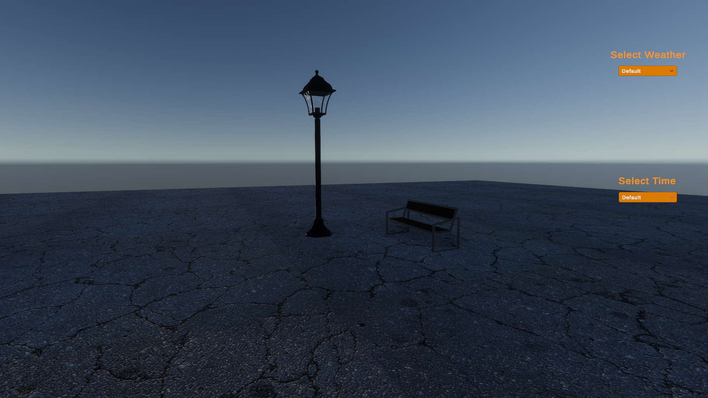
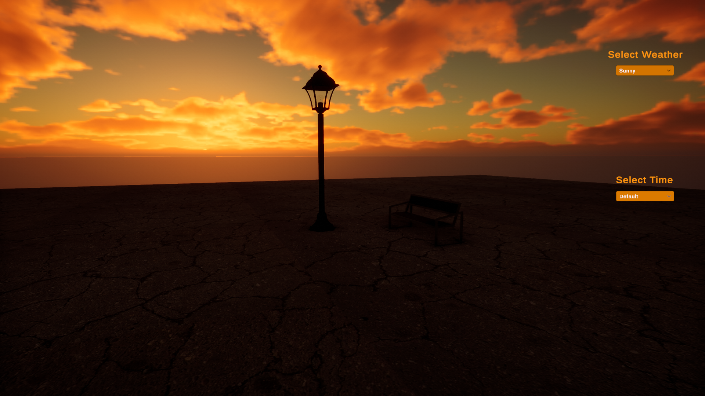
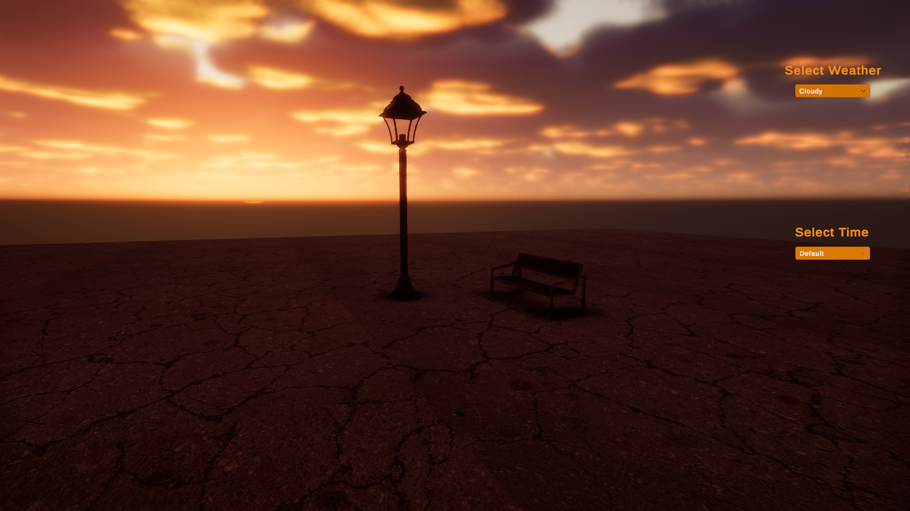
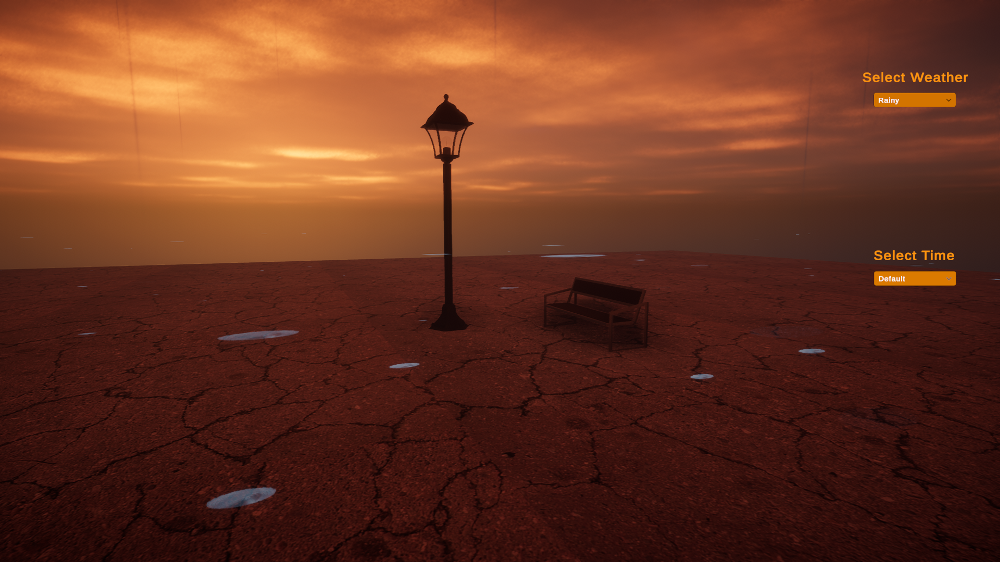
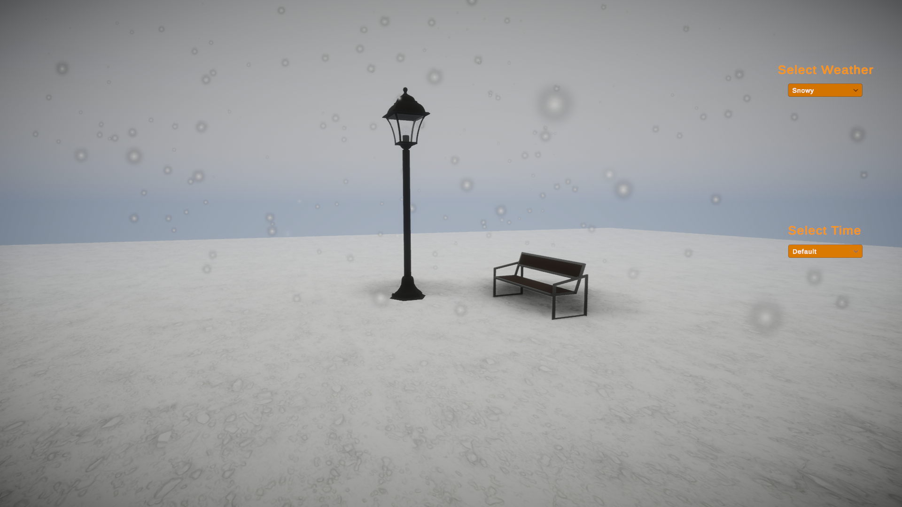
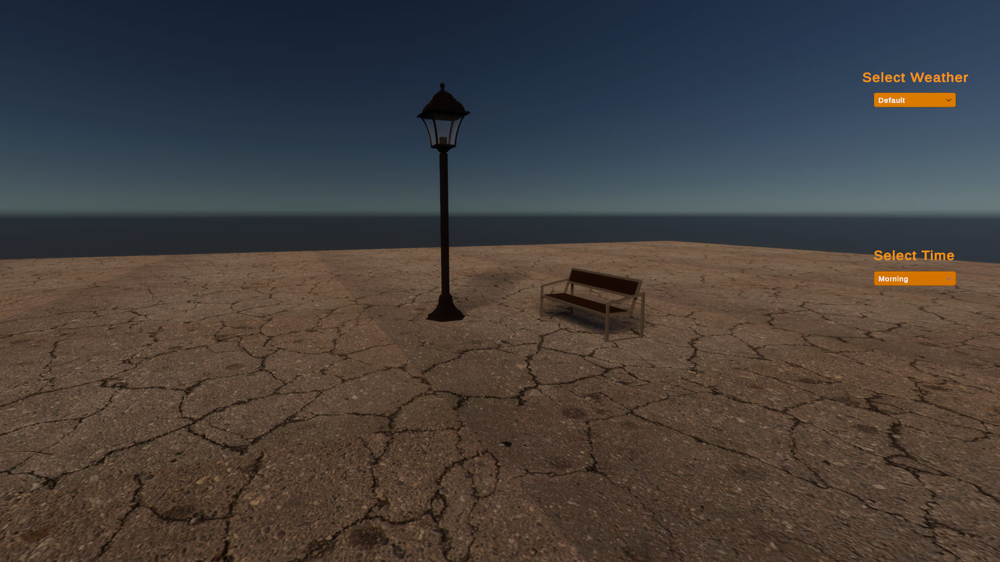
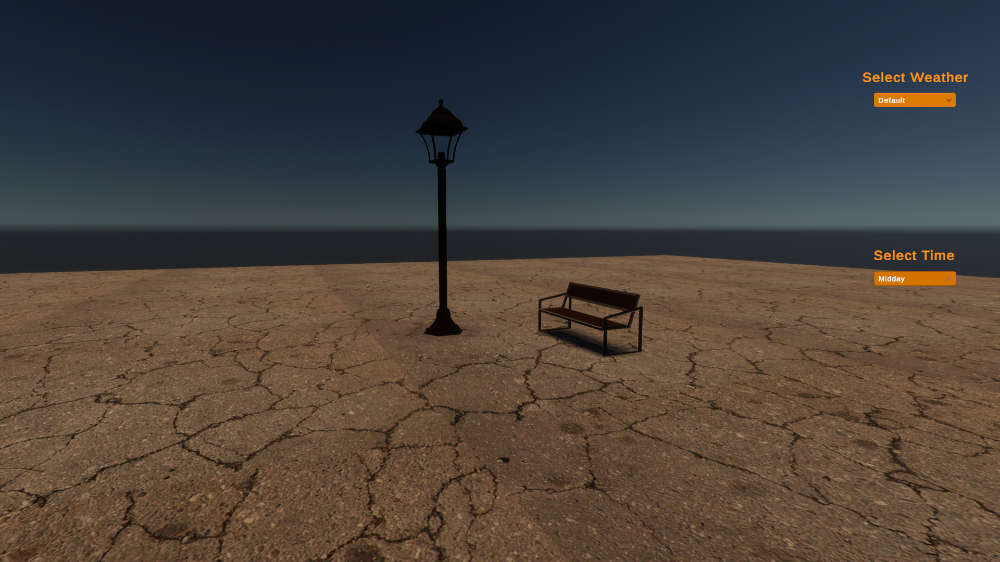
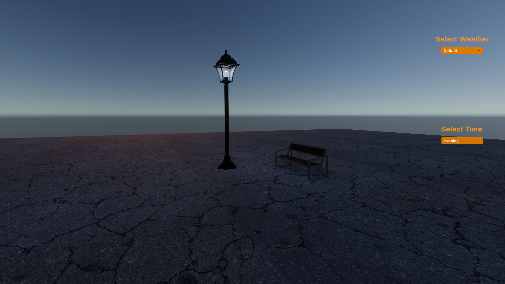
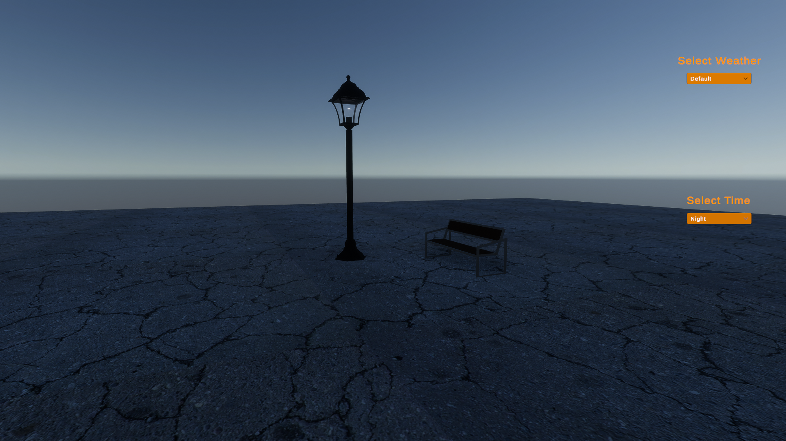

# Weather & Day/Night State Machine

A Unity HDRP project that demonstrates a modular and scalable **State Machine architecture** for controlling **Weather** and **Time of Day** independently.

The project was developed as both a game programming exercise and a software architecture practice, focusing on clean code, object-oriented design, and building maintainable gameplay systems.

---

# Overview

The environment is divided into two independent state machines:

* **Weather States**
* **Time States**

Both systems can be changed independently at runtime through a simple UI, allowing different combinations such as:

* Morning + Sunny
* Morning + Rainy
* Evening + Cloudy
* Night + Snowy

Each state controls only the systems it owns, making the project easier to extend and reducing coupling between gameplay systems.

---

# Features

## Weather States

* Default
* Sunny
* Cloudy
* Rainy
* Snowy

## Time States

* Default
* Morning
* Midday
* Evening
* Night

## Environment Control

* Dynamic day/night switching
* Dynamic weather switching
* HDRP light intensity control
* Color temperature adjustment
* Volume activation/deactivation
* Rain particle effects
* Snow particle effects
* Ground material switching

## Runtime Controls

* Weather dropdown
* Time dropdown
* Instant state switching
* Independent Weather and Time state machines

---
## Screenshots

### Default State

---

### Weather States

| Sunny                 | Cloudy                 |
| --------------------- | ---------------------- |
|  |  |

| Rainy                 | Snowy                 |
| --------------------- | --------------------- |
|  |  |

---

### Time States

| Morning                 | Midday                 |
| ----------------------- | ---------------------- |
|  |  |

| Evening                 | Night                 |
| ----------------------- | --------------------- |
|  |  |

---

## Demo Video

A short demonstration of the project is available below.

[www.linkedin.com/in/hossein-nardini-2567033a1](https://www.linkedin.com/posts/hossein-nardini-2567033a1_unity-gamedevelopment-gamedev-ugcPost-7489273183095726081-Mw2y/?utm_source=share&utm_medium=member_desktop&rcm=ACoAAGKGuaIBH30_WbWuXyUcvPW-3sPdKbcFlR4)
---

# Architecture

The project was heavily refactored during development to improve separation of concerns and reduce class responsibilities.

## Core Components

### IState

Common interface implemented by every state.

Responsibilities:

* Enter()
* Exit()

---

### Manager

Coordinates both state machines.

Responsibilities:

* Initialize systems
* Store current states
* Handle state transitions

---

### State Registry

Stores and provides all State configuration assets.

Responsibilities:

* Register State ScriptableObjects
* Provide configuration data to states

---

### ScriptableObject State Settings

Every state uses its own ScriptableObject configuration instead of hardcoded values.

Examples:

* Sun rotation
* Light intensity
* Color temperature
* Other environment settings

This makes every state data-driven and easy to tweak directly inside the Unity Inspector.

---

### Controllers

Environment logic is separated into dedicated controllers.

Examples include:

* Light Controller
* Volume Controller
* Particle Controller
* Material Controller

Each controller is responsible for only one part of the environment, reducing duplicated code and improving maintainability.

---

### UI Manager

Acts as a bridge between the user interface and the state system.

Responsibilities:

* Initialize dropdowns
* Handle UI events
* Request state changes

---

# Design Goals

The project focuses on applying clean architecture principles rather than building a complete gameplay system.

Concepts practiced include:

* State Machine Pattern
* Separation of Concerns
* Single Responsibility Principle (SRP)
* Data-Driven Design
* ScriptableObjects
* Runtime System Management
* Refactoring
* Dependency Reduction
* Modular Architecture

---

# What I Learned

During this project I practiced:

* Designing a modular State Machine architecture
* Building reusable gameplay systems
* Separating gameplay logic from presentation
* Refactoring large classes into focused components
* Using ScriptableObjects to create data-driven systems
* Reducing coupling between systems
* Identifying and removing code smells
* Structuring Unity projects for scalability

---

# Technologies

* Unity
* C#
* High Definition Render Pipeline (HDRP)
* ScriptableObjects
* TextMeshPro
* Object-Oriented Programming (OOP)
* State Machine Pattern

---

# Author

Hossein

This project was built as part of my game programming journey to strengthen software architecture, object-oriented design, and gameplay programming skills before moving on to larger Unity projects.
